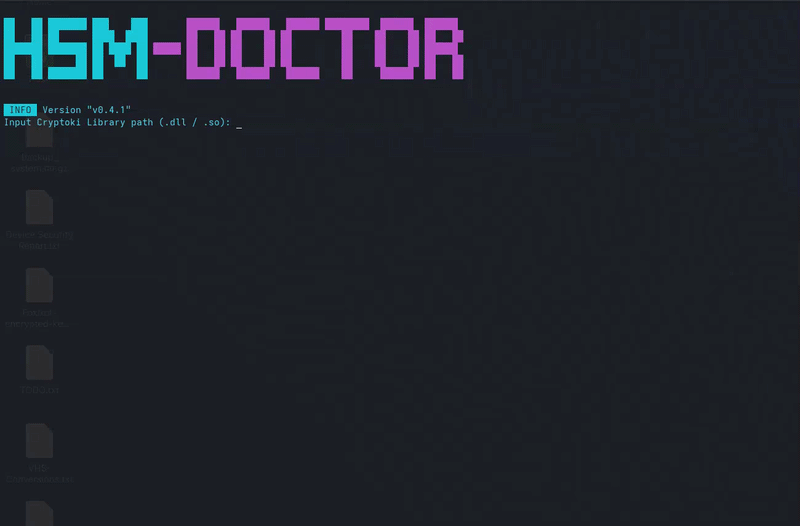

# HSM-Doctor

[](https://github.com/reznik99/go-hsm-doc/actions/workflows/ci.yml)


<!-- PROJECT LOGO -->
<br />
<div align="center">
  <p align="center">
    A simple CLI tool to inspect, debug and manage keys on PKCS#11-compliant HSMs and PIV smartcards.
  </p>

    

</div>

### Functionality
1. Inspect HSM, slot and token info
2. List slots and the objects inside them
3. Generate RSA, EC, AES, DES and 3DES keys (menu adapts to what the token supports)
4. Import, export and delete certificates and keys
5. Generate a CSR from a key, signed on the token (HSM and PIV)

## Getting Started

### Requirements

- [Go](https://go.dev/dl/) 1.25+ (to build)
- A PKCS#11 module (`.so` / `.dll`) for your token — e.g. SoftHSM2, YubiKey `ykcs11`, or OpenSC

### Build & run

```sh
make build      # produces ./build/hsm-doctor
./build/hsm-doctor
```

On start the tool asks for the path to your Cryptoki library, then drops you into an
interactive menu. Common module paths:

| Token | Module (typical path) |
|---|---|
| SoftHSM2 | `/usr/lib64/libsofthsm2.so` |
| YubiKey PIV | `/usr/lib64/libykcs11.so.2` |
| PIV smartcard (OpenSC) | `/usr/lib64/opensc-pkcs11.so` |

> Tip: `pkcs11-tool --module <path> -I -L` is a quick way to confirm a module loads your token.

### Supported tokens

| Token | Type | Notes |
|---|---|---|
| SoftHSM2 | Software HSM | Free-form labels/IDs, all mechanisms |
| Thales Luna | Hardware HSM | Free-form labels/IDs |
| YubiKey PIV | Smartcard (`ykcs11`) | Writes need the management key; `CKA_ID` selects the PIV slot |
| Generic PIV | Smartcard (`opensc-pkcs11`) | Same PIV constraints via OpenSC |

For PIV specifics (slot ↔ `CKA_ID` mapping, management-key auth), the tool has a built-in
slot picker; PIV keys are non-extractable, so only public keys and certificates can be exported.

## Development

Install the dev tools (pinned to the versions CI and the Makefile use):

```sh
go install github.com/golangci/golangci-lint/v2/cmd/golangci-lint@v2.12.2
go install github.com/vektra/mockery/v2@v2.53.6
```

```sh
make mocks   # regenerate mocks into internal/hsm/mocks
make test    # unit tests (race) + coverage report at build/coverage.html
make lint    # golangci-lint
make build   # build ./build/hsm-doctor
```

Package layout:

- `internal/cli` — the interactive UI and command handlers
- `internal/hsm` — the PKCS#11 session wrapper (the token driver)
- `internal/pkcs11util` — pure encoding/parsing helpers (attributes, curves, key parsing)

<!-- LICENSE -->
## License  

Distributed under the MIT License. See `LICENSE` for more information.  

<!-- CONTACT -->
## Contact  

Francesco Gorini - goras.francesco@gmail.com - https://francescogorini.com  

Project Link: [https://github.com/reznik99/go-hsm-doc](https://github.com/reznik99/go-hsm-doc)  

<p align="right">(<a href="#top">back to top</a>)</p>  
